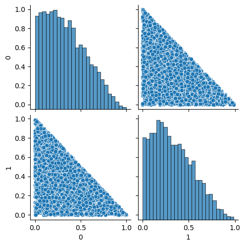
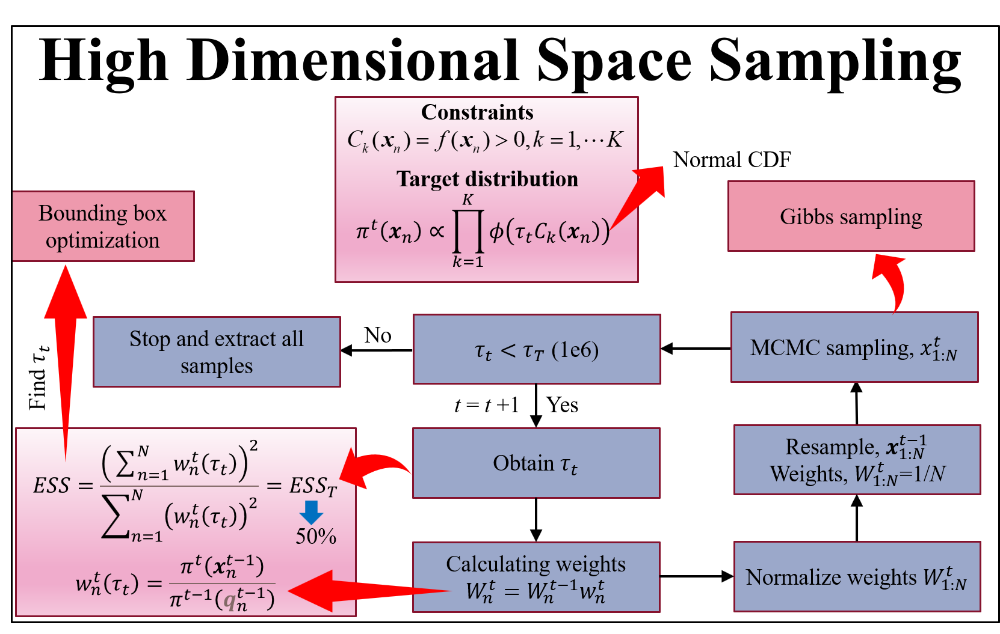
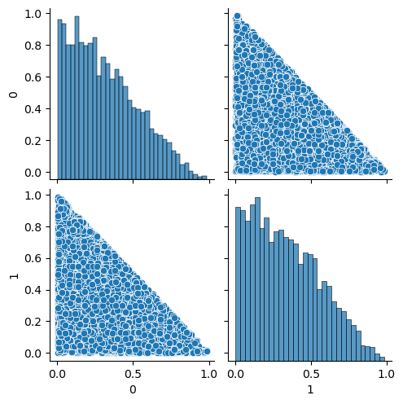
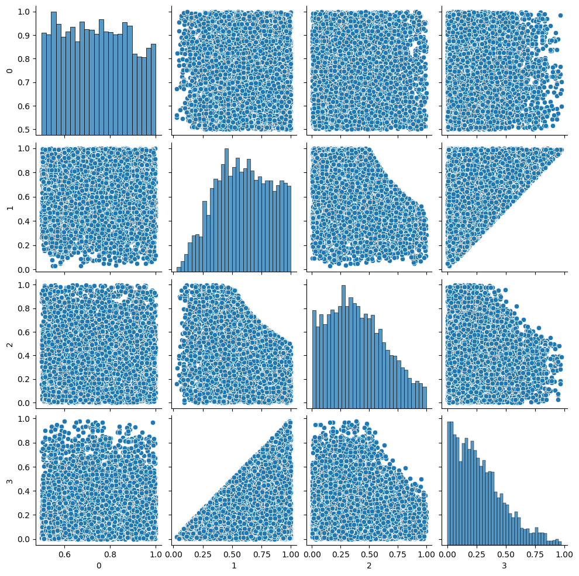
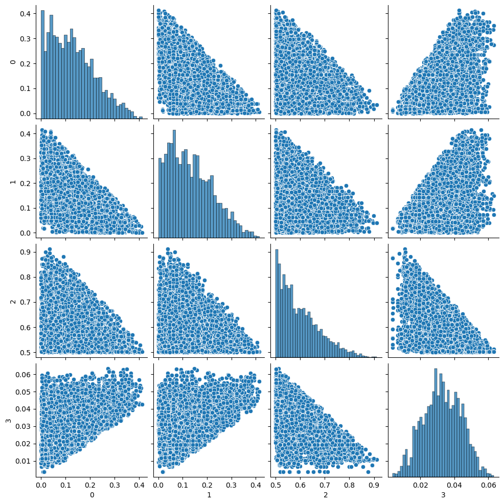
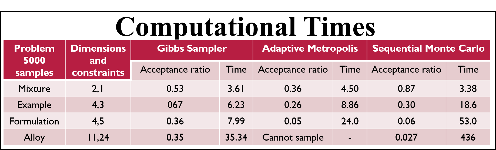
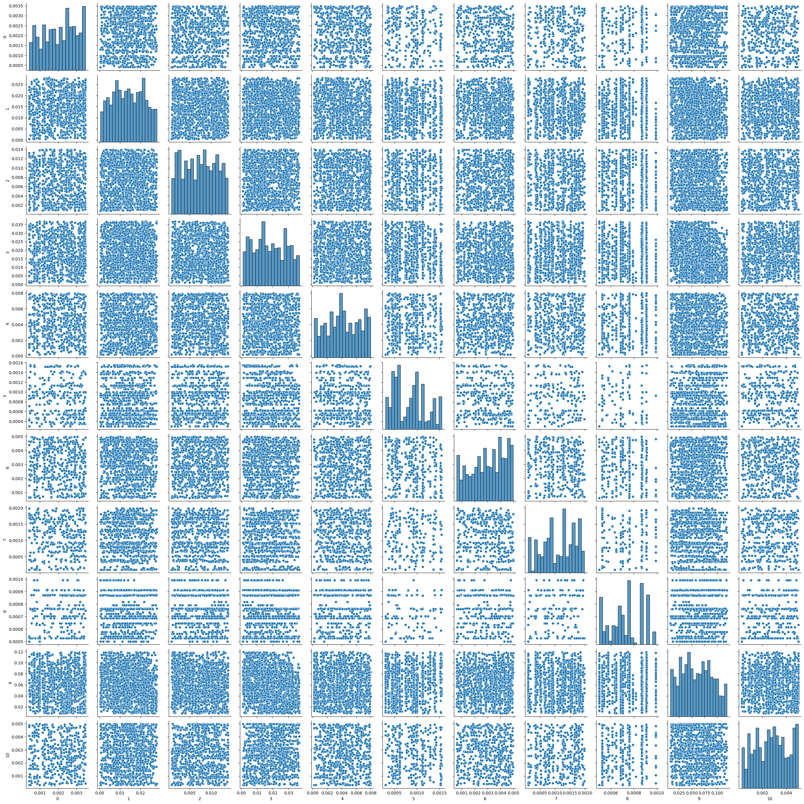

Sampling from High Dimensional Space
================
Karthik Reddy Lyathakula

## Introduction

This program samples from high dimensional space with *K* non-linear
constraints given by

*C**k*(*x*) = *f*(*x*) &gt; 0, *k* = 1, ..., *K*

here ***x*** is an n-dimensional vector. Each dimension is normalized to
one and can take values between 0 and 1. An example for a constrained
domain is 1- x\[0\] - x\[1\] &gt;0 and samples generated in the
constrained domain are shown below.

The following four methods are implemented to sample from any number of
nonlinear constraints and the final samples generated are compared:

1.  [Metropolis-Hastings Random
    Walk](https://arxiv.org/pdf/1504.01896.pdf)
2.  [Adaptive
    Metropolis](https://projecteuclid.org/journals/bernoulli/volume-7/issue-2/An-adaptive-Metropolis-algorithm/bj/1080222083.full)
3.  [Gibbs
    Sampler](https://www.tandfonline.com/doi/abs/10.1080/00031305.1992.10475878)
4.  [Sequential Monte Carlo (SMC)](https://arxiv.org/abs/1512.07328)

### 1. Metropolis-Hasting Random Walk

The Metropolis random walk algorithm is the Markov chain Monte Carlo
(MCMC) method that explores the space by naive way of generating random
numbers in the given space using identity matrix as the covariance
matrix and accepting if sample satisfies the constraints or rejecting
it. The method is very slow and can not sample for some high dimensions.

### 2. Adaptive Metropolis

The adaptive Metropolis algorithm is the extension of the random
algorithm and it accelerates the sampling process by utilizing the
accepted samples. It generates a covariance matrix based on the accepted
samples and the covariance matrix is used for generating the next
sample. The initial covariance matrix is assumed to identity matrix and
the covariance matrix is updated after a certain fixed number of
samples, k0. In this program, the covariance is updated after ever k0=1
until 100 accepted samples and then the matrix is updated after every
k0=100 accepted samples.

### 3. Gibbs Sampler

The Gibbs is similar to adaptive Metropolis but the samples are
generated samples in one dimension at a time.

### 4. Sequential Monte Carlo

The sequential Monte Carlo (SMC) starts from a uniform sample on the
hypercube of the dimensions and samples are moved into the region of
constraints using a combination of importance sampling and MCMC steps.
The sequential Monte Carlo can sample from a highly constrained space
efficiently. In the above three MCMC sampling methods, an initial start
becomes crucial for efficient sampling. Using an initial start far away
from the constrained domain results in a large number of initial burn-in
to find the sample inside the constrained space and sampling becomes
inefficient, In SMC, an initial start is not needed and generates
samples throughout the region at the start. The below figure shows the
flow chart for the SMC method for high dimensional space sampling.

The SMC method relaxes the initial constrained by using the normal CDF
*ϕ*(*τ**t**C**k*(*x**n*))
and generates a fixed number of samples,
*N*
through out the domain. Each sample is given the same initial weight and
the weight is updated based on the target distribution,
*π**t*(*x**n*)
. The updated weight of the samples that are not inside the relaxed
constraints becomes zero. The samples with zero weights are discarded
and copies of samples with non-zero weights are generated to maintain
the fixed number of samples,
*N*
, throughout the simulation. For generating copies of the samples,
[systematic
resampling](https://ieeexplore.ieee.org/abstract/document/4378824) is
used.

Next, the MCMC step is used to explore the space around each sample. In
this program, MCMC steps are chosen to be 2 for each particle, and Gibbs
methods used as the MCMC step

## Results

The program is tested on four cases and results are shown below using
SMC. The input files for the examples are in the code folder.

1.  Mixture

1.  Example

1.  Formulation

1.  Alloy

The below figure shows the computational time for different examples for
generating 5000 samples. For the first three examples, all the methods
generated similar structures of samples and for alloy, the adaptive
metropolis was not able to generate any samples.

The results show that the adaptive metropolis cannot sample for the
alloy case (11 dimensions and 24 constraints) due to the improper
initial identity covariance matrix. Gibbs sampler can sample for the
alloy and the below figure shows the samples generated.

and below figure shows the samples generated using SMC.

It can be observed that the Gibbs sampler did not explore the space
efficiently whereas the SMC was able to efficiently explore the space.
The computational time for SMC is very high but for more complicated
cases where the initial guess is difficult to find, Gibbs sampler fails
and computational time might be much higher than SMC.

## References

-   Robert, Christian P., and Gareth O. Roberts. “Rao-Blackwellization
    in the MCMC era.” arXiv preprint arXiv:2101.01011 (2021).
-   Haario, Heikki, Eero Saksman, and Johanna Tamminen. “An adaptive
    Metropolis algorithm.” Bernoulli 7.2 (2001): 223-242.
-   Casella, George, and Edward I. George. “Explaining the Gibbs
    sampler.” The American Statistician 46.3 (1992): 167-174.
-   Golchi, Shirin, and Jason L. Loeppky. “Monte Carlo based designs for
    constrained domains.” arXiv preprint arXiv:1512.07328 (2015).
-   <https://ieeexplore.ieee.org/abstract/document/4378824>
